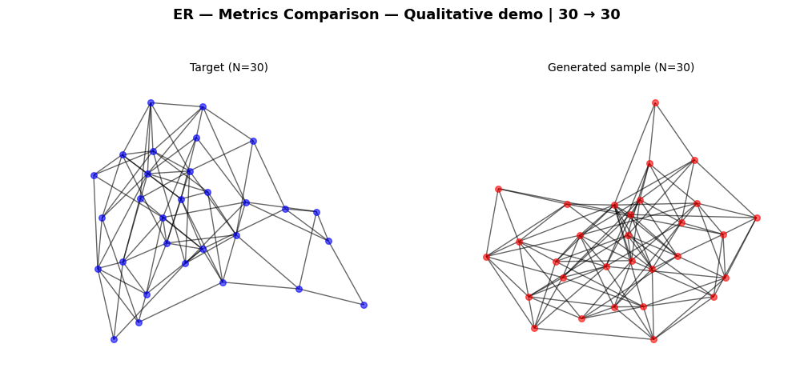
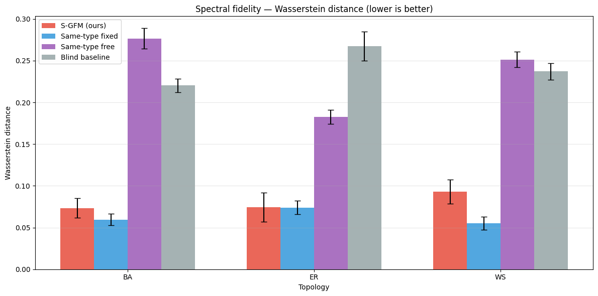
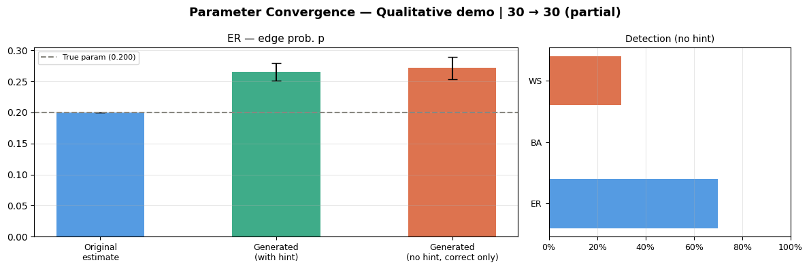

# Graph Flow Matching

A prototype generative model for graphs, built from scratch to learn modern generative methods (flow matching) and apply them to graph-structured data.

Given a target number of nodes and a target *spectral profile* (a histogram of the normalized Laplacian's eigenvalues), generate a graph whose spectrum matches the target. The spectrum encodes a lot of a graph's global structure, so conditioning on it is a way to ask for a graph "shaped like this" without specifying the edges directly.

*A target graph (left) and a graph the model generated to match its spectral profile (right).*

## Result

The model is trained on random graphs from three families (Erdős–Rényi, Barabási–Albert, Watts–Strogatz) and asked to generate graphs matching held-out target spectra. The plot below compares the spectral distance (Wasserstein, lower is better) between the generated graphs and the targets, against three baselines.

- **S-GFM (ours)** — given only the target spectral histogram, no family or parameter labels.
- **Same-type fixed** — oracle: same family *and* the exact generating parameters. Best case.
- **Same-type free** — same family, but default parameters rather than the target's.
- **Blind baseline** — a *different* graph family from the target's.

Across all three families the model lands close to the oracle and clearly below the naive baselines, so the spectral conditioning is doing real work at this scale. It also recovers generating parameters reasonably well when the generated graph is re-fit:

## How it works

- **Flow matching** on the vectorized upper triangle of the adjacency matrix: the model learns a velocity field that transports Gaussian noise to a valid graph.
- **Conditioning** on the target size and spectral histogram via **classifier-free guidance**.
- **Training data:** random ER, BA, and WS graphs across a range of sizes and parameters.
- **Evaluation:** a harness comparing generated graphs to baselines on spectral Wasserstein distance, with optional graph-model parameter estimation via the `statGraph` R package.

## Honest limitations

This is a learning prototype. The velocity field is an MLP over a fixed-size adjacency, so it is not permutation-equivariant and does not generalize across graph sizes; performance degrades as you move away from the training range. Fixing that is the next step.

## Running it

Open `Graph_Flow_Matching_v8.ipynb` in Google Colab (GPU runtime recommended) and run top to bottom. If GitHub fails to render the notebook, view it via [nbviewer](https://nbviewer.org/) by pasting the notebook URL.
